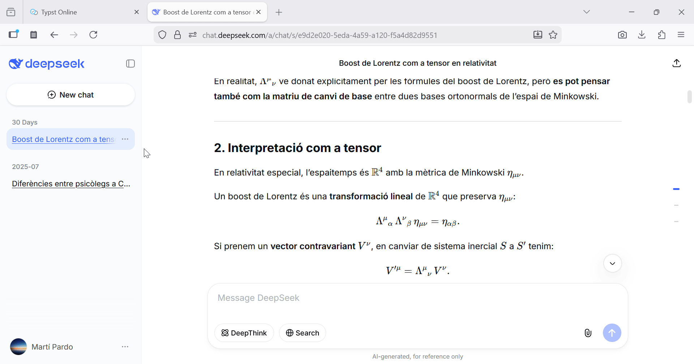

# CopyLaTeX

A Chrome and Firefox extension that lets you quickly copy LaTeX code (KaTeX or MathJax) from equations displayed on websites like ChatGPT, DeepSeek, or any blog using mathematical equations. It works simply by hovering over an equation and clicking to copy the LaTeX expression.

Version 1.1: Now it also works with with Wikipedia and Wikiwand images.

Version 1.2: Now it also works for MathJax v3 (when there is no LaTeX code in the HTML) via API.

Version 1.3: Dark mode enabled and replaced check emoji with SVG icon.

Version 1.4: New feature! Select text (that includes formulas), right click on it and a `Copy as Markdown (with LaTeX)` option will appear.

## Example GIFs
#### KaTeX

#### MathJax

#### Wikipedia images

#### Copy as Markdown

You can use [https://markdown-preview-katex.vercel.app/](https://markdown-preview-katex.vercel.app/) to test this feature.

#### Copy as Typst

You can use [https://typst-online.vercel.app/](https://typst-online-editor.vercel.app/) to test this feature.

You can use [https://markdown-preview-katex.vercel.app](https://markdown-preview-katex.vercel.app) to test the Copy as Markdown function.

## Popular Sites Using MathJax/KaTeX
Generally any math, physics, or engineering-related blog or website. Some typical examples:
- KaTeX: ChatGPT, DeepSeek, Notion, Gemini...
- MathJax: Stack Exchange, ProofWiki...

## Host permissions and speed
You can check the javascript source code yourself. It loads after everything and is very fast and small sized. However if you want you can always customize in which hosts (websites) the extension loads or not:

This is done in `chrome://extensions` in the extension 'Details'.

Recommended websites to add

- https://chatgpt.com/*
- https://chat.deepseek.com/*
- https://math.stackexchange.com/*
- https://physics.stackexchange.com/*
- https://proofwiki.org/*
- https://\*.wikipedia.org/*
- https://www.wikiwand.com/*
- https://mathoverflow.net/*
- https://\*.notion.site/*
- https://publish.obsidian.md/*
- https://nbviewer.org/*
- https://gemini.google.com/*
- https://www.phind.com/*
- https://chat.mistral.ai/*
- https://librechat-librechat.hf.space/*
- https://www.perplexity.ai/*
- https://phys.libretexts.org/*

## How it works technically

1. **Content Script (`content.js`)**:
   -  **For KaTeX**
      - Automatically detects all `` elements on the page.
      - Extracts the LaTeX code from `<annotation encoding="application/x-tex">`.
   - **For Gemini KaTeX**
     - Extracts LaTeX inside `data-math` attribute.
   - **For MathJax**
     - Extracts LaTeX inside `<script type="math/tex">` elements.
   - **For MathJax v3/v4**
      - Injects page script (`mathjax-api.js`) to extract LaTeX from `mjx-container` elements via MathJax's API. Only possible via API and inject script because no LaTeX code present in the generated HTML.
   - **For Wikipedia**
     - Extracts LaTeX from `alt` attributes of images.
   - **For all of them** 
   - Shows an overlay when hovering over the equation.
   - Allows clicking to copy the code to clipboard using `navigator.clipboard.writeText()`.
   - Uses an inline `<svg>` to avoid external file dependencies.

2. **CSS (`overlay.css`)**:
   - Overlay styling: white background, subtle border and shadow.
   - Large, readable text.
   - Centered over the KaTeX formula.
   - `pointer` cursor.

3. **Extension declaration `manifest.json`**:
   - Injects `content.js`, `overlay.css` and the other scripts.
   - Sets information and permissions of the extension.
4. **Background script `background.js`**:
   - Handles context menu (right click). Needed to display the "Copy as Markdown" option when right clicking the selected text.
5. **Selection script `selection-to-markdown.js`**:
   - A set of functions, workers and utilities to convert HTML to markdown while preserving our extracted LaTeX. Under the hood uses the `turndown.js` library and the `turndown-plugin-gfm.js` GitHub-flavored markdown plugin for converting HTML to Markdown.

### How to test the extension locally

1. Download the `src` directory (using for example [download-directory.github.io](https://download-directory.github.io/)). Rename it if you want.
2. Then go to `chrome://extensions` (as if it were an URL) and in the top left click the 'Load unpacked' button and select the `src` (or whatever is named now) folder.

## Links
- Chrome Add-on page: [https://chromewebstore.google.com/detail/copy-latex-katex-mathjax/lmhdbdfaadjfjclobmodomehekpjpkgn](https://chromewebstore.google.com/detail/copy-latex-katex-mathjax/lmhdbdfaadjfjclobmodomehekpjpkgn)
- GitHub Repo: [https://github.com/Mapaor/copy-latex-chrome-extension](https://github.com/Mapaor/copy-latex-chrome-extension)
- README as a website: [https://mapaor.github.io/copy-latex-chrome-extension/](https://mapaor.github.io/copy-latex-chrome-extension/)

## Firefox version
There is also a Firefox version of this extension: [https://github.com/Mapaor/copy-latex-fireofx-extension](https://github.com/Mapaor/copy-latex-firefox-extension) 

You can also use this extension in Brave and Arc (they support Chrome extensions by default). 

I also plan to adapt this code for Edge and Opera and publish in their respective places. 

A Safari version is not planned because publishing in Safari is ridiculously expensive.

## Acknowledgements

Credits to @leander-ow for his dark mode contribution and to  @ashigirl96 for suggesting and providing a working code implementation for the "Copy as Markdown" feature. 

This extension also works thanks to the following open source projects:
- [Turndown](https://github.com/mixmark-io/turndown) - Library for converting HTML to Markdown
- [tex2typst](https://github.com/qwinsi/tex2typst) - Library for converting LaTeX to Typst
- [markdown2typst](https://github.com/Mapaor/markdown2typst) - Library for converting Markdown to Typst

## License

MIT License.

It is MIT Licensed so that anyone can customize it to their needs but please don't just copy-cat the code and publish it with a new name, it's weird. 

If you have an idea for a new feature open an issue and let me know! Also if you have the time to implement a feature you want it would be great if you made a pull request.

## Planned features:

- [X] **Text selection to Markdown**: Select some text that includes equations, right click and a new option "[Extension Icon] Copy as Markdown" appears.
- [ ] **Typst support**: 
  Pop up with a toggle between LaTeX and Typst
- [ ] **Custom  delimiters**: 
Chose between no delimiters (default), `$` and `$$`, `\(` and `\[`, always `$`, or always `$$`.